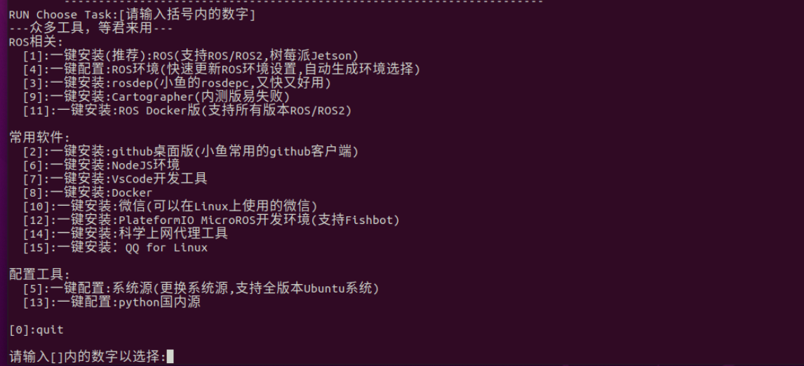
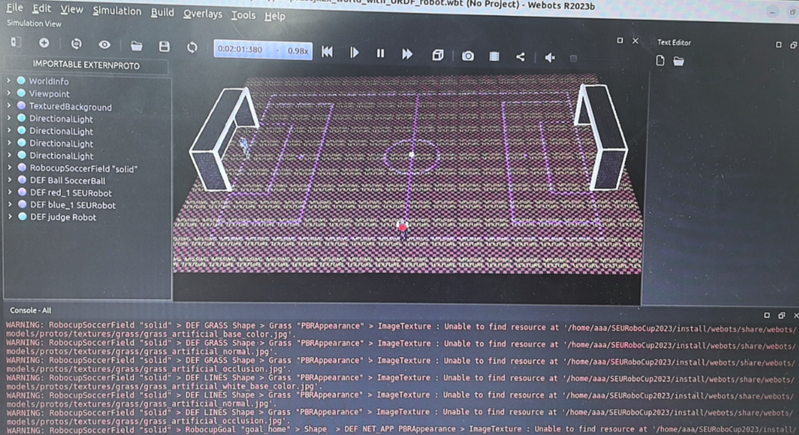
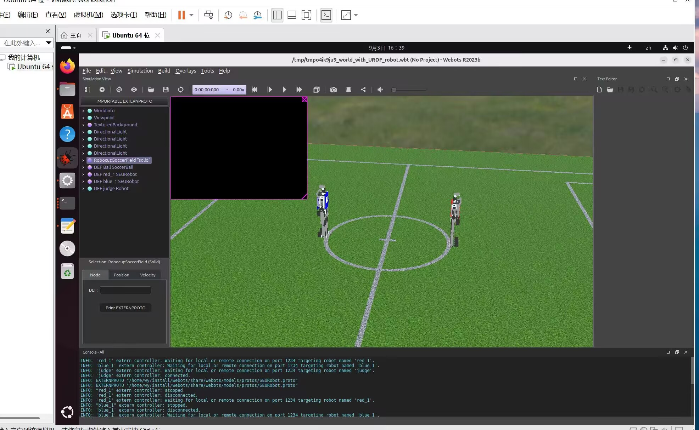
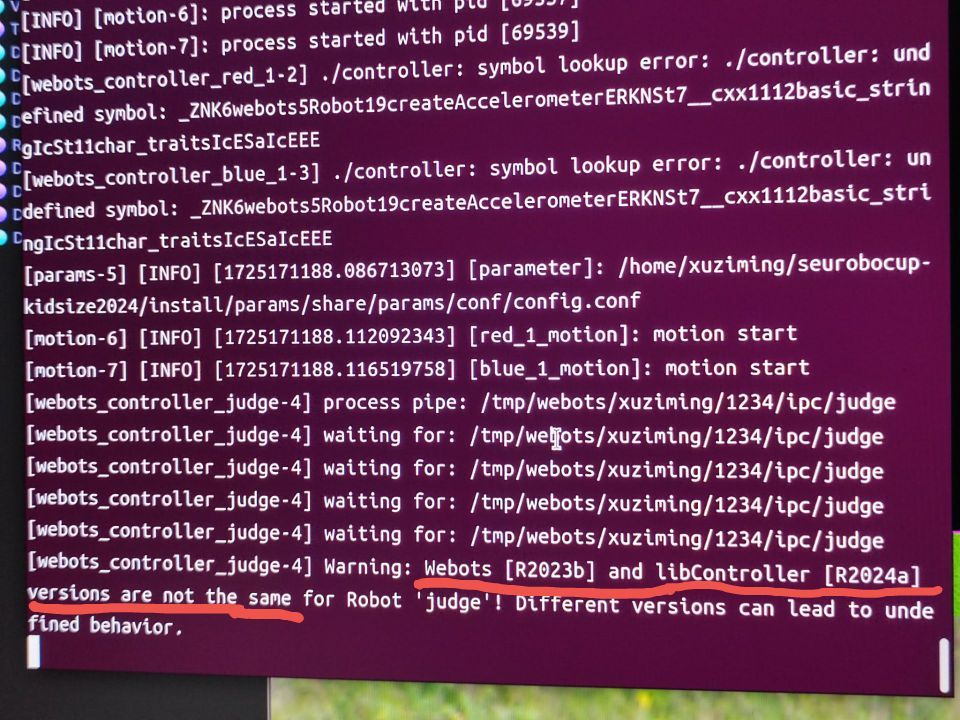
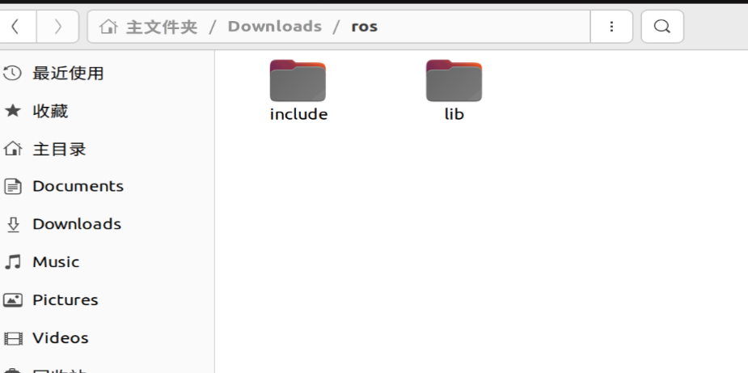
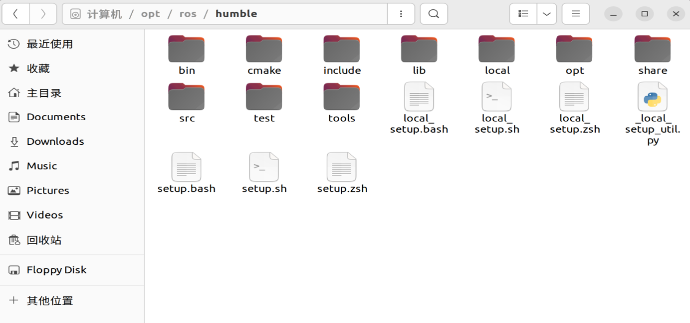
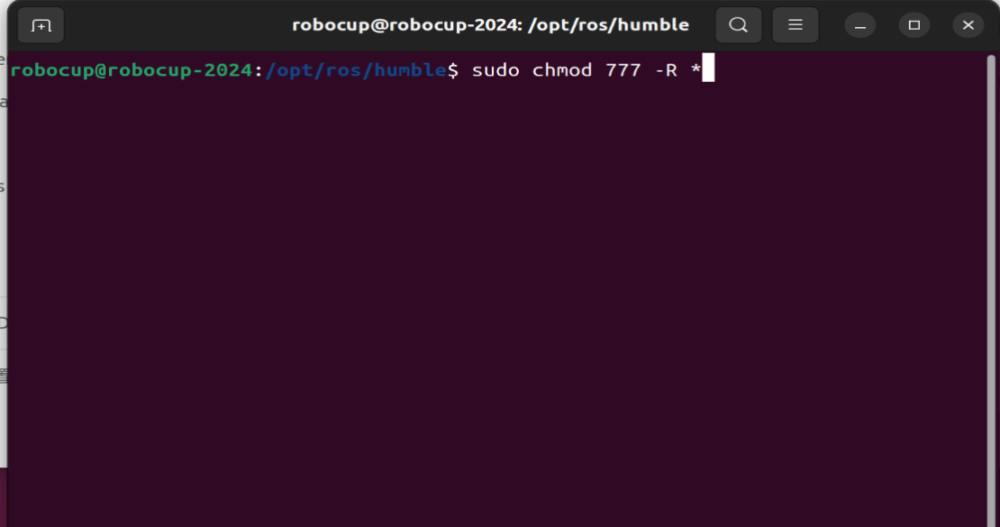
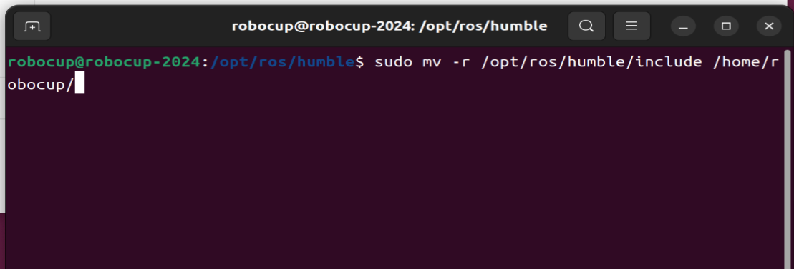
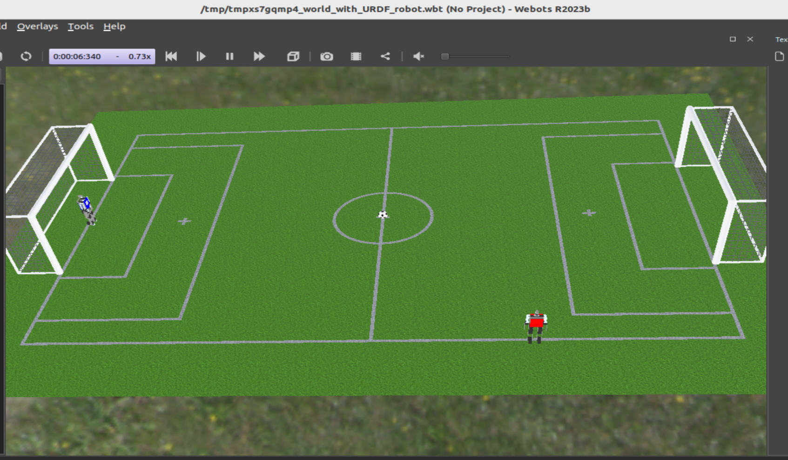
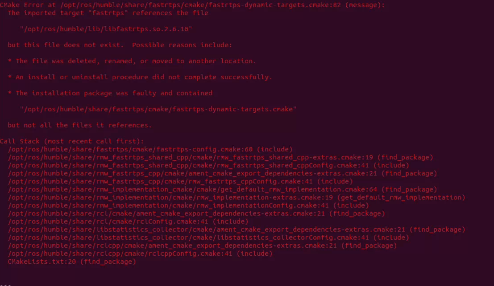

# SEURoboCup2026

东南大学 Robocup Kidsize 2026年校赛代码

遇到问题请先行使用搜索引擎和**AI工具**，或查阅 [FAQ](https://gitee.com/wcyabc123/seurobocup-kidsize2024/wikis/%E9%A6%96%E9%A1%B5)

## 1环境配置

Ubuntu及Webots下载:

- Ubuntu22.04
- ROS2 HUMBLE
- Webots 2023b [校内下载链接](https://pan.seu.edu.cn/link/AA287928B6D7274AC29C423DBC4D7F4D85)  [Github链接](https://github.com/cyberbotics/webots/releases#release-R2023b)

### ros2安装教程

- 方法1.官方安装教程（详情查看ros2官方网站）
- 方法2.鱼香一键安装

```Shell

wget http://fishros.com/install -O fishros && . fishros
```



选择5，一键转换系统源，之后输入数字2，更换系统源并清理第三方源，输入数字2，回车，更换系统源并清理第三方源
输入数字1，回车，添加ROS/ROS2源
到这里，系统源就更换并且添加完毕了，有些出现的安装不成功有部分原因就是没有更换系统源。

- 继续执行

```Shell

wget http://fishros.com/install -O fishros && . fishros
```

然后我们输入 1 一键安装 –> 不更换源安装 –> 选择ros2（humble） –> 进行安装（安装ros2）
继续输入3 配置rosdep
最后输入4 更新系统环境

### webots安装教程

工具安装：

```Shell
sudo apt update && sudo apt install -y   build-essential   cmake   git   python3-colcon-common-extensions   python3-pip   python3-rosdep   python3-vcstool   wget
pip3 install -U argcomplete
```

然后手动下载webots2023的安装包到Ubuntu中，进入到webots2023的安装目录下，右键进入终端，输入：

```Shell
sudo apt install ./webots_2023b_amd64.deb
sudo apt install -f
echo "source /opt/ros/humble/setup.bash" >> ~/.bashrc
source ~/.bashrc
sudo apt install ros-$ROS_DISTRO-webots-ros2
```

## 2使用方法

### 编译

```Shell
cd ~
git clone https://gitee.com/peterhunt/seurobocup-kidsize2026.git
```

进入克隆文件夹目录下输入

```Shell
colcon build
```

进行编译。
编译一般在2min以内。

### 初始化

```Shell
sudo pip3 install rosdepc
sudo rosdepc init
```

若报错可参考：[Q4 sudo rosdep init 报错](https://gitee.com/robocup/SEURoboCup2022/wikis/软件环境?sort_id=4351269#q4-sudo-rosdep-init报错)

```Shell
rosdepc update
echo "export WEBOTS_HOME=/usr/local/webots" >> ~/.bashrc  
echo "export LD_LIBRARY_PATH=$LD_LIBRARY_PATH:${WEBOTS_HOME}/lib/controller" >> ~/.bashrc
ws=`pwd`  # 记录工作路径
echo "source $ws/install/setup.bash" >> ~/.bashrc  #添加项目环境变量
source ~/.bashrc  #应用环境变量设置
```

### 创建包

首先须选定一个 **全英文小写字母** 的队名，且其长度不超过 20个字符，也不能为 `test`。以下用 `template` 表示。

！！注意：`template`仅为**占位符**。以下代码无法直接运行，请务必将 `template` 替换为自己的队名！！

输入：

```Shell
cd src # 进入到 seurobocup-kidsize2026/src 文件夹
chmod +x ./createPkg.sh
```

准备编译，请务必将 template 替换为自己的队名

```Shell
./createPkg.sh template # 请务必将 template 替换为自己的队名
cd ..
colcon build
```

### 运行

+ 启动仿真相关的节点新建一个终端，输入：

  ```Shell
  ros2 launch start start_launch.py
  ```

  点球阶段则运行

  ```Shell
  ros2 launch penalty_start start_launch.py
  ```
+ 启动比赛控制器新建一个终端，进入到`seurobocup-kidsize2026`路径，输入：

  ```Shell
  ros2 run gamectrl gamectrl
  ```

  点球阶段则运行

  ```Shell
  ros2 run penalty_gamectrl gamectrl
  ```
+ 启动我方机器人的控制节点新建一个终端，输入：

  ```Shell
  ros2 launch template player_launch.py
  ```
+ 启动敌方机器人的控制节点新建一个终端，输入：

  ```Shell
  ros2 launch template2 player_launch.py
  ```
+ **若修改过 [player.cpp](src/template/src/player.cpp)，则需要重新编译**：

  ```Shell
  colcon build
  ```

## 3常见问题

+ 在初始化编译阶段，使用双系统需要添加很多依赖，由于不同设备需要的依赖不同，各位根据报错自行添加。

+ 使用双系统，50系列显卡，需要装载驱动，各位自行查阅资料装载。

+ 打开webots后长时间卡在Downloading assets（或一直停在加载界面），终端里controller反复打印waiting for: /tmp/webots/ph/1234/ipc/red_1后报can not connect to webots

  这是因为RobocupSoccerField.proto里的EXTERNPROTO用了纯文件名写法（如"Grass.proto"），Webots在本机找不到时会去GitHub下载官方资源，网络不通就会一直卡住。如果使用代理或者网络通畅没有出现这个问题则可跳过。如果出现卡住的问题，可以参照下面解决：

  仓库已改为相对路径写法，请确认你的代码与仓库一致：

  ```Shell
  head -4 src/simulation/webots/models/protos/RobocupSoccerField.proto
  ```
  应看到 `EXTERNPROTO "./Grass.proto"` 和 `EXTERNPROTO "./RobocupGoal.proto"`，而不是不带 `./` 的纯文件名。若不一致请改为相对路径后重新编译：
  ```Shell
  colcon build --packages-select webots
  ```

+ 打开webots后出现如下问题
  
  则移动install/webots/share/webots/models/worlds里面的texture文件夹到proto文件夹中
  
+ 如果启动webots后看到初始位置不正确，摄像头黑屏或者且终端打印以下内容：
  Warning:Webots[R2023b] and libController [R2025a] versions are not the same for Robot 'judge'!

  一般是ros版本问题。请先在任意路径下输入指令
  ```Shell
  cd /opt/ros/
  ```

  如果该路径下没有humble文件夹，请卸载ros后重新安装ros的humble版本，如果这一步正常，请继续下一步。

  如果启动webots后看到初始位置不正确，且出现以下错误：
  

  则是ros2库更新函数语法导致的，解决方法有三个，一个是下载之前的ros版本，一个是更新项目代码中调用的函数，本次我们直接操作底层，改变ros的库函数和头文件。

  操作步骤如下：
  1.下载旧版库文件：
  到群文件中下载ros2023.zip，解压后打开，里面有include和lib两个文件夹
  

  2.寻找ros库文件目录
  依次点击其他位置->计算机->opt/ros/humble,看到如下界面：
  

  3.获取文件权限：
  右键打开终端，输入sudo chmod 777 -R *获取超级权限
  
  ```Shell
  sudo chmod 777 -R *
  ```

  

  4.移动文件：
  先把lib、include移动到其他地方作备份,再把下载的文件转移到ros目录下：
  ```Shell
  sudo mv /opt/ros/humble/include /home/username/    #把username改成用户名
  sudo mv /opt/ros/humble/lib /home/username/    #把username改成用户名
  sudo cp -r /home/username/Downloads/ros2023/*  /opt/ros/humble/     
  #把username改成用户名，前一个为下载文件的目录，根据实际情况更换
  ```

  

  5.打开webots查看启动结果
  如果操作正确，就可以看到如下结果了，接下来去试试启动节点，看看机器人能否正常启动，如果可以，恭喜你，可以开始编写代码了！
  

+ 如果colcon build之后出现了如下报错（找不到libfastrtps.so.2.6.10）
  
  这是ros2025和ros2023版本差异问题。请在群中下载ros2025.zip，注意一定要在ubuntu中解压。
  输入指令
  
  ```Shell
  sudo cp -r /home/username/Downloads/ros2025/lib/libfastrtps.so.2.6.10 /opt/ros/humble/lib/     #把username改成用户名，前一个为下载文件的目录，根据实际情况更换
  ```
  之后应该就可以正常编译了
