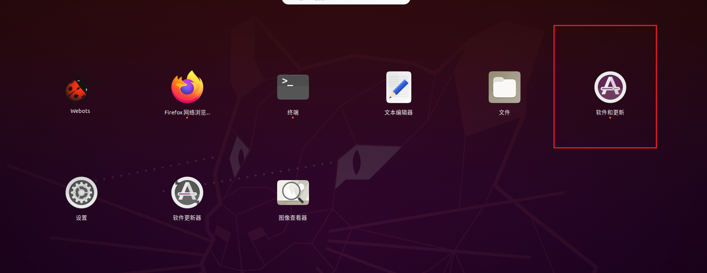
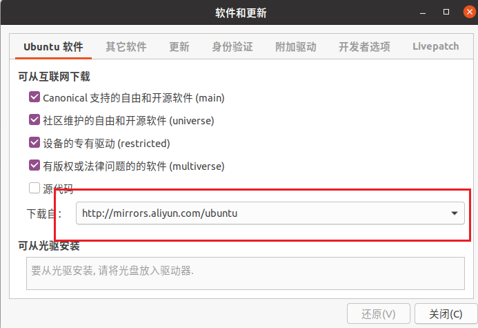

# Ubuntu 下安装教程

以下步骤均在 Ubuntu 22.04 测试通过


## ROS2 安装

> 主要参考[官方教程](https://docs.ros.org/en/humble/Installation/Ubuntu-Install-Debians.html)

以下是详细步骤：

### 设置软件源




###  首先确保环境支持UTF-8
```shell
locale  # 检查系统是否安装有UTF-8

# 如果没有则进行安装
sudo apt update && sudo apt install locales
sudo locale-gen en_US en_US.UTF-8
sudo update-locale LC_ALL=en_US.UTF-8 LANG=en_US.UTF-8
export LANG=en_US.UTF-8

locale  # 安装好后再次检查
```
### 设置源
```shell
# First ensure that the Ubuntu Universe repository is enabled
sudo apt install software-properties-common
sudo add-apt-repository universe
```
```shell
# Now add the ROS 2 GPG key with apt
sudo apt update && sudo apt install curl -y
sudo curl -sSL https://raw.githubusercontent.com/ros/rosdistro/master/ros.key -o /usr/share/keyrings/ros-archive-keyring.gpg
```
```shell
# Then add the repository to your sources list
echo "deb [arch=$(dpkg --print-architecture) signed-by=/usr/share/keyrings/ros-archive-keyring.gpg] http://packages.ros.org/ros2/ubuntu $(. /etc/os-release && echo $UBUNTU_CODENAME) main" | sudo tee /etc/apt/sources.list.d/ros2.list > /dev/null
```

### ros2与webots的安装
```Shell
sudo apt update
```
```Shell
sudo apt upgrade
```
然后进行ros2-humble的安装，在终端输入：
```Shell
sudo apt install ros-humble-desktop
```

工具安装：
```Shell
sudo apt update && sudo apt install -y   build-essential   cmake   git   python3-colcon-common-extensions   python3-pip   python3-rosdep   python3-vcstool   wget
pip3 install -U argcomplete
```

然后手动下载webots2023的安装包到Ubuntu中，进入到webots2023的安装目录下，右键进入终端，输入：
```Shell
sudo apt install ./webots_2023b_amd64.deb
sudo apt install -f
echo "source /opt/ros/humble/setup.bash" >> ~/.bashrc
source ~/.bashrc
sudo apt install ros-$ROS_DISTRO-webots-ros2
```
